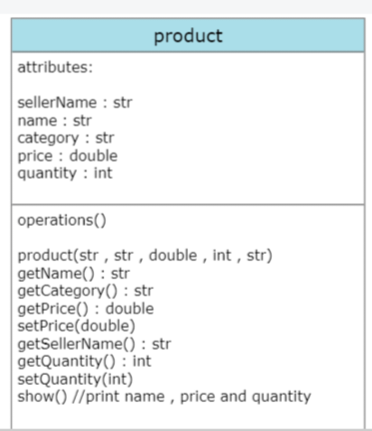
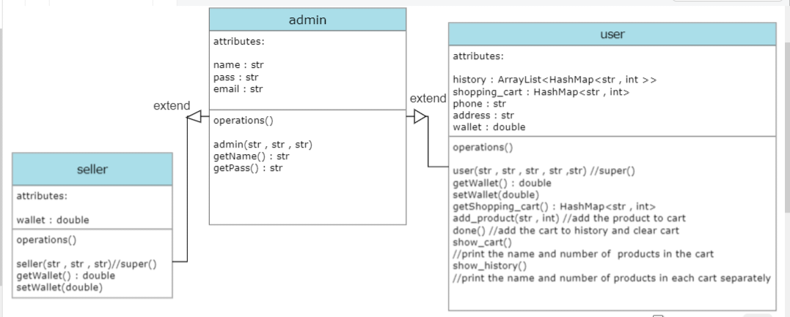

# Nowruz project

## navid ebadi 401222093

## Introduction:
Designing a software for a store with features such as 
viewing available products, creating a shopping cart, viewing previous purchases and a digital wallet for the user.
Add new products, change prices, increase inventory and access income for the seller.
Adding new sellers and admins and accessing store income by admin .

## Design and Implementation:
- classes:
    - product :
      - 
    - seller, admin and user :
      - 
    - shop : 
      - runMenu()
- main:
    - main class works with runMenu method in shop class.
    - at first, we define some products, users, sellers and an admin.
    - runMenu method works with one main while loop and several sub-while loop 
    that the program enters the main loop every time it exits the sub-loops.
    - To stop the program, the turn off command is used,
    with which the program leaves the main loop and the program ends.

## Testing and Evaluation:
1. 1
2. mohammad
3. me1380
4. mohammadEB@gmail.com
5. 09122224518
6. ahar starkhan pelak 5
7. 2
8. mohammad
9. me1380
10. 4
11. 1
12. 3000
13. 1
14. 1
15. 2
16. 1
17. 2
18. 3
19. 1
20. 0
21. 2
22. 2
23. 3
24. 0
25. 5
26. 3
27. apple
28. 4567
29. 1
30. 0
31. 3
32. 2
33. 8
34. 5
35. 4
36. navid
37. 1313
38. 2
39. nike
40. 2099
41. nike@gmail.com
42. 1
43. 0
44. 4
45. 5

## Conclusion:
for further development of the program, various features and facilities can be used,
such as the possibility of changing the user's profile after creating an account,
or displaying the user's profile and digital wallet at each stage of the purchase, etc.